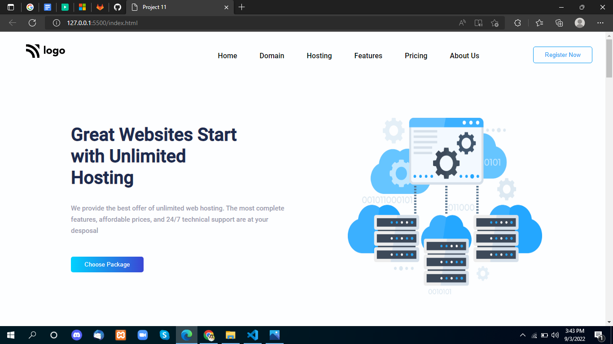
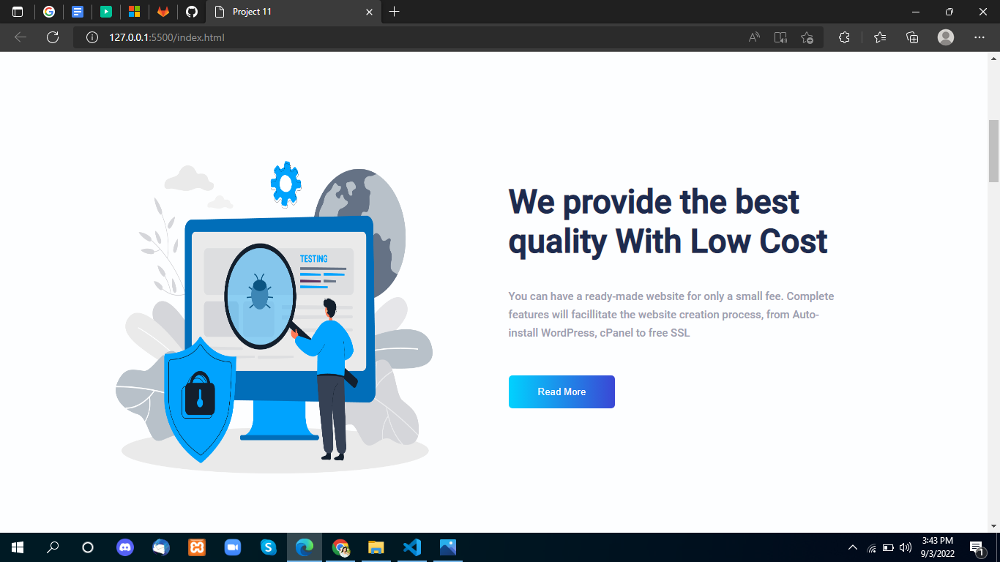
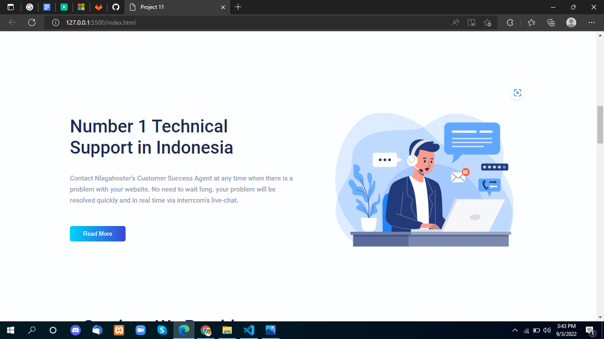
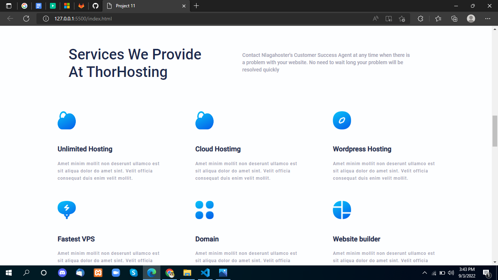
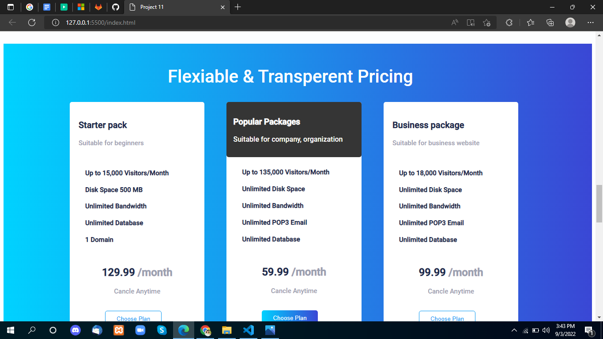
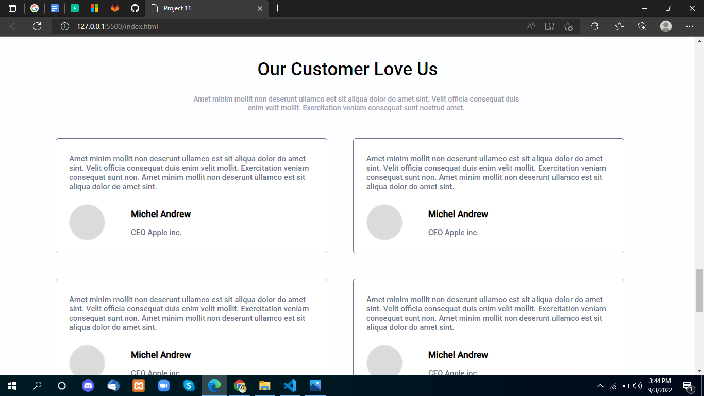
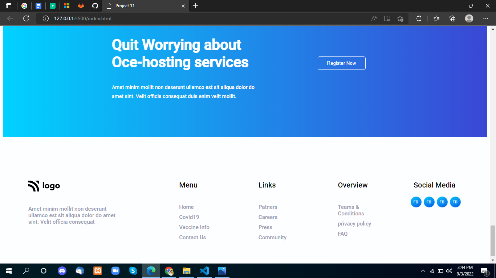

# Project-11

 

## Project live link
[Project-11](# "Not yet")

## Screenshot

 

## project Type
- UI Design
- One Page Website

## My learning from this Project
- Nav Bar
- Header footer
- Grid-Template
- Flex-box
- Idea How to write HTML

## Time to make this project
#### Approx 5 hour to make this project
